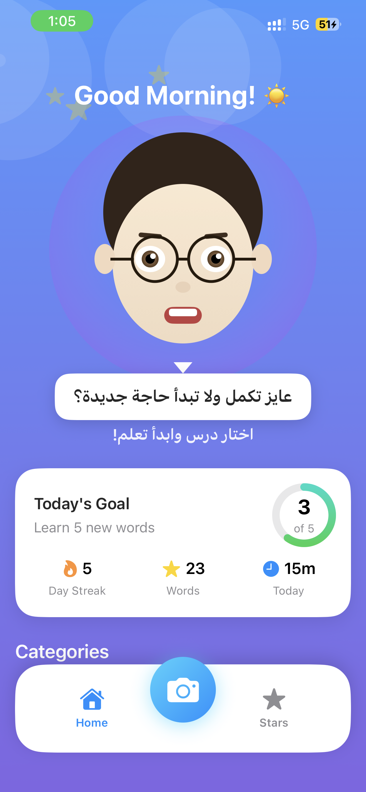
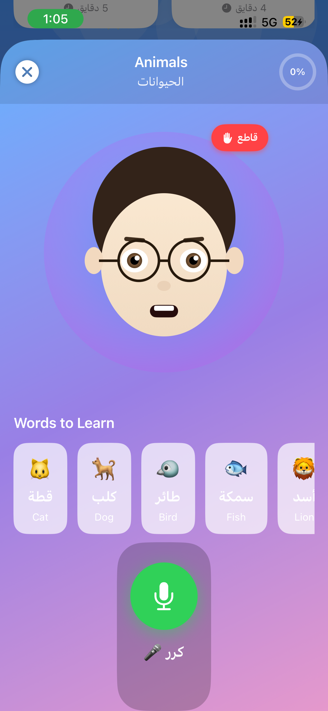
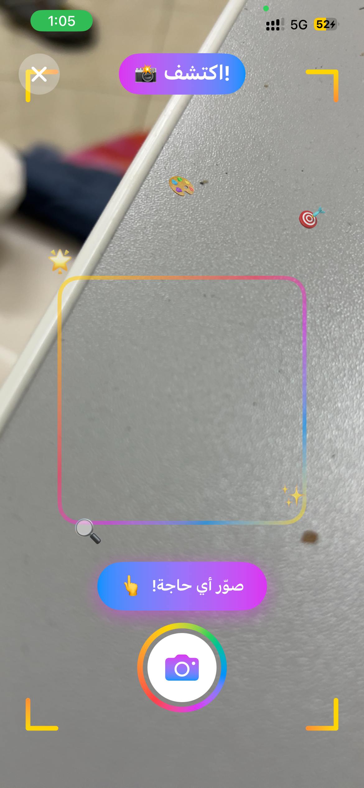
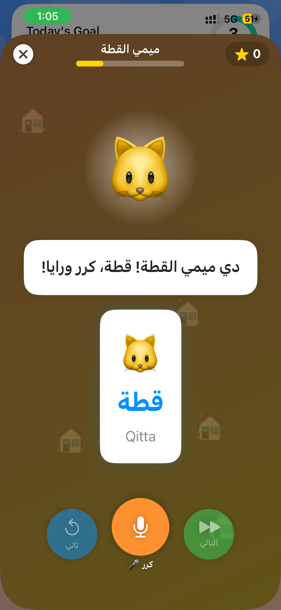
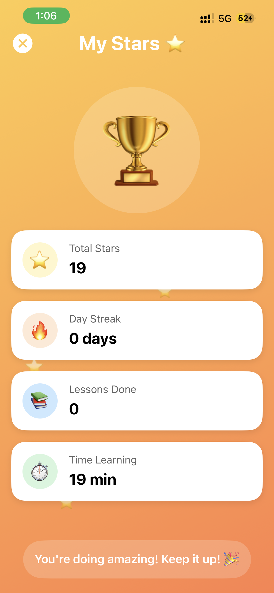

# EL-Modras (المدرس) - AI Arabic Language Tutor

> Real-time AI-powered Arabic language tutor using **Gemini Live API** and **Google ADK** for natural voice conversations, visual vocabulary learning, and interactive storytelling.


## 📖 Overview

EL-Modras ("The Teacher" in Arabic) is a **Live Agent** that breaks the "text box" paradigm by enabling natural, real-time voice conversations for learning Arabic. Using **Gemini Live API** (`client.aio.live.connect()`) and **Google ADK (Agent Development Kit)**, learners can:

- 🗣️ **Speak naturally** with an AI tutor via real-time bidirectional audio streaming
- 🔄 **Interrupt freely** — barge-in support lets you speak mid-response
- 👁️ **Point their camera** at objects to learn Arabic vocabulary visually
- 📖 **Interactive Stories** with AI-generated illustrations (Gemini image generation)
- 🎯 **Get instant pronunciation feedback** in real-time
- 📊 **Track progress** with personalized lesson recommendations

## 🎥 Demo Video

> **[Watch the Demo Video](https://www.youtube.com/shorts/Urj9OcEWvuo)** — Shows real-time voice conversations, camera vocabulary, interactive stories, and pronunciation feedback.

## ☁️ Proof of Google Cloud Deployment

The backend is live on **Google Cloud Run**:
- **Service URL**: `https://el-modras-backend-508801329902.us-central1.run.app`
- **Health Check**: [`/health`](https://el-modras-backend-508801329902.us-central1.run.app/health) returns `{"status":"healthy","gemini_connected":true,"live_api_ready":true,"adk_agent_ready":true}`
- **Key code files demonstrating Google Cloud usage**:
  - [`Backend/src/services/gemini_live_service.py`](Backend/src/services/gemini_live_service.py) — Gemini Live API (`client.aio.live.connect()`)
  - [`Backend/src/services/adk_agent.py`](Backend/src/services/adk_agent.py) — Google ADK Agent
  - [`Backend/src/services/gemini_service.py`](Backend/src/services/gemini_service.py) — Gemini GenAI SDK (`genai.Client()`)
  - [`terraform/main.tf`](terraform/main.tf) — Infrastructure as Code (Cloud Run, Firestore, Secret Manager)

## 🏗️ Architecture

```
┌─────────────────────────────────────────────────────────────────┐
│                         iOS App (SwiftUI)                        │
│  ┌─────────────┐  ┌─────────────┐  ┌─────────────────────────┐  │
│  │  HomeView   │  │ LessonView  │  │    CameraVocabView      │  │
│  │  (MVVM)     │  │  (MVVM)     │  │       (MVVM)            │  │
│  └──────┬──────┘  └──────┬──────┘  └───────────┬─────────────┘  │
│         │                │                     │                 │
│  ┌──────▼────────────────▼─────────────────────▼─────────────┐  │
│  │  ┌──────────────┐  ┌──────────────┐  ┌──────────────────┐ │  │
│  │  │InteractiveStory│ │ AudioService │  │ GeminiService    │ │  │
│  │  │  View (MVVM) │  │(AVAudioEngine)│  │  (Network)      │ │  │
│  │  └──────────────┘  └──────────────┘  └──────────────────┘ │  │
│  └───────────────────────────┬───────────────────────────────┘  │
└──────────────────────────────┼───────────────────────────────────┘
                               │ WebSocket / HTTPS
                               ▼
┌─────────────────────────────────────────────────────────────────┐
│                    Google Cloud Run                              │
│  ┌───────────────────────────────────────────────────────────┐  │
│  │                 FastAPI Backend (Python)                   │  │
│  │  ┌──────────────┐  ┌──────────────┐  ┌──────────────────┐ │  │
│  │  │  Live API    │  │  ADK Agent   │  │  Image Gen API   │ │  │
│  │  │  Router      │  │  Router      │  │  Router          │ │  │
│  │  └──────┬───────┘  └──────┬───────┘  └────────┬─────────┘ │  │
│  │         │                 │                    │           │  │
│  │  ┌──────▼─────────────────▼────────────────────▼─────────┐│  │
│  │  │           Services Layer (google-genai SDK)            ││  │
│  │  │                                                        ││  │
│  │  │  • GeminiLiveService                                   ││  │
│  │  │    └─ client.aio.live.connect() [Real Live API]        ││  │
│  │  │    └─ Bidirectional audio streaming                    ││  │
│  │  │    └─ Barge-in / interruption support                  ││  │
│  │  │                                                        ││  │
│  │  │  • ADKTutorService (Google ADK)                        ││  │
│  │  │    └─ Agent with tools: teach_word, evaluate,          ││  │
│  │  │       generate_story, recognize_object, track_progress ││  │
│  │  │                                                        ││  │
│  │  │  • GeminiService                                       ││  │
│  │  │    └─ Vision (camera object recognition)               ││  │
│  │  │    └─ Pronunciation analysis (audio multimodal)        ││  │
│  │  │    └─ TTS with Gemini audio output                     ││  │
│  │  │    └─ Image generation for stories                     ││  │
│  │  └────────────────────────┬───────────────────────────────┘│  │
│  └───────────────────────────┼───────────────────────────────┘  │
└──────────────────────────────┼───────────────────────────────────┘
                               │
                               ▼
┌─────────────────────────────────────────────────────────────────┐
│                    Google Cloud Services                         │
│  ┌──────────────┐  ┌──────────────┐  ┌────────────────────────┐ │
│  │   Gemini 2.0 │  │  Firestore   │  │   Secret Manager       │ │
│  │  Flash Live  │  │  (Progress)  │  │   (API Keys)           │ │
│  └──────────────┘  └──────────────┘  └────────────────────────┘ │
│  ┌──────────────┐  ┌──────────────┐  ┌────────────────────────┐ │
│  │ Cloud Speech │  │  Cloud TTS   │  │   Cloud Storage        │ │
│  │ to-Text      │  │  (WaveNet)   │  │   (Assets)             │ │
│  └──────────────┘  └──────────────┘  └────────────────────────┘ │
└─────────────────────────────────────────────────────────────────┘
```

## 🛠️ Tech Stack

### iOS App
- **SwiftUI** with Clean Architecture (MVVM)
- **AVAudioEngine** for real-time audio capture/playback
- **AVFoundation** for camera integration
- **WebSocket** for bidirectional audio streaming
- **iOS Speech Framework** for local speech recognition

### Backend (Python)
- **FastAPI** with async/await
- **`google-genai`** SDK (new Google GenAI SDK) — `from google import genai`
- **Google ADK** (Agent Development Kit) — `from google.adk import Agent`
- **Gemini Live API** — `client.aio.live.connect()` for real-time bidirectional streaming
- **Gemini 2.0 Flash** for vision, pronunciation analysis, TTS, and image generation
- **Cloud Run** for serverless hosting

### Google Cloud Services
- **Gemini 2.0 Flash Live** (`gemini-2.0-flash-live-001`) — Live API
- **Cloud Run** — Backend hosting
- **Cloud Firestore** — User data & progress
- **Secret Manager** — API key storage
- **Cloud Speech-to-Text** — Arabic speech recognition
- **Cloud Text-to-Speech** (WaveNet) — Arabic voice synthesis
- **Cloud Storage** — Asset storage

## 🚀 Quick Start

### Prerequisites

- Xcode 15+ (for iOS app)
- Python 3.11+
- Google Cloud SDK
- Gemini API key ([Get one here](https://aistudio.google.com/apikey))

### 1. Clone the Repository

```bash
git clone https://github.com/TaherZaki/el-modras.git
cd el-modras
```

### 2. Backend Setup

```bash
cd Backend

# Create virtual environment
python -m venv venv
source venv/bin/activate  # Windows: venv\Scripts\activate

# Install dependencies (uses google-genai + google-adk)
pip install -r requirements.txt

# Set environment variables
export GOOGLE_CLOUD_PROJECT=your-project-id
export GEMINI_API_KEY=your-gemini-api-key

# Run locally
python src/main.py
```

The backend will start at `http://localhost:8080`

**Verify it's running:**
```bash
curl http://localhost:8080/health
# Returns: {"status":"healthy","gemini_connected":true,"live_api_ready":true,"adk_agent_ready":true}
```

### 3. iOS App Setup

1. Open `EL-Modras.xcodeproj` in Xcode
2. Update `Core/Network/AppConfig.swift` with your backend URL:
   ```swift
   static var backendURL: String {
       return "http://localhost:8080"  // or your Cloud Run URL
   }
   ```
3. Add your Gemini API key to the scheme environment variables
4. Build and run on a physical device (camera/microphone required)

### 4. Deploy to Google Cloud

#### Option A: Easy Deploy (Recommended)
```bash
cd Backend
chmod +x scripts/easy-deploy.sh
./scripts/easy-deploy.sh
```

#### Option B: Full Infrastructure with Terraform
```bash
# Setup infrastructure
cd terraform
cp terraform.tfvars.example terraform.tfvars
# Edit terraform.tfvars with your values
terraform init
terraform apply

# Deploy backend
cd ../Backend
chmod +x scripts/deploy.sh
./scripts/deploy.sh
```

#### Option C: Manual Deploy
```bash
cd Backend
gcloud run deploy el-modras-backend \
    --source . \
    --region us-central1 \
    --allow-unauthenticated \
    --memory 1Gi \
    --set-secrets GEMINI_API_KEY=gemini-api-key:latest \
    --set-env-vars ENVIRONMENT=production
```

## 📁 Project Structure

```
EL-Modras/
├── EL-Modras/                    # iOS App (SwiftUI)
│   ├── Domain/                   # Business logic layer
│   │   ├── Entities/             # Data models
│   │   ├── UseCases/             # Application use cases
│   │   └── Repositories/         # Repository interfaces
│   ├── Data/                     # Data layer
│   │   ├── Repositories/         # Repository implementations
│   │   └── DataSources/          # Remote & local data sources
│   ├── Presentation/             # UI layer (MVVM)
│   │   ├── Home/                 # Home screen (Kids UI)
│   │   ├── Lesson/               # Voice lesson screen
│   │   ├── Story/                # Interactive stories with AI illustrations
│   │   ├── CameraVocab/          # Camera vocabulary screen
│   │   └── Progress/             # Progress tracking screen
│   └── Core/                     # Core services
│       ├── Network/              # API services (GeminiService)
│       ├── Audio/                # Audio processing, caching, speech recognition
│       └── DI/                   # Dependency injection
├── Backend/                      # Python backend
│   ├── src/
│   │   ├── main.py               # FastAPI application
│   │   ├── config.py             # Configuration
│   │   ├── routers/
│   │   │   ├── live.py           # Gemini Live API WebSocket streaming
│   │   │   ├── agent.py          # ADK Agent endpoints
│   │   │   ├── image_gen.py      # Gemini image generation
│   │   │   ├── vision.py         # Camera object recognition
│   │   │   ├── pronunciation.py  # Pronunciation analysis
│   │   │   ├── tts.py            # Text-to-Speech
│   │   │   ├── chat.py           # Text chat fallback
│   │   │   └── session.py        # Session management
│   │   └── services/
│   │       ├── gemini_service.py       # Core Gemini API (google-genai SDK)
│   │       ├── gemini_live_service.py  # Live API (client.aio.live.connect)
│   │       ├── adk_agent.py            # ADK Agent (Google ADK)
│   │       └── websocket_manager.py    # WebSocket management
│   ├── scripts/                  # Deployment scripts (IaC)
│   ├── Dockerfile
│   └── requirements.txt
├── terraform/                    # Infrastructure as Code
│   ├── main.tf                   # GCP resources (Cloud Run, Firestore, etc.)
│   └── README.md
└── README.md
```

## ✨ Features

### 🗣️ Real-Time Voice Conversations (Gemini Live API)
- **True bidirectional audio streaming** via `client.aio.live.connect()`
- Natural Arabic tutoring with persistent live connections
- **Barge-in support** — interrupt the teacher mid-sentence
- Low-latency audio streaming via WebSocket
- Automatic voice activity detection

### 🤖 ADK Agent (Agent Development Kit)
- Multi-step tutoring workflows orchestrated by ADK
- **6 specialized tools**: teach_word, evaluate_pronunciation, generate_story_scene, recognize_object, track_progress, get_lesson_content
- Context-aware responses based on lesson state

### 👁️ Visual Vocabulary Learning (Gemini Vision)
- Point camera at any object
- Gemini Vision identifies and teaches Arabic word
- Includes pronunciation, transliteration, and example sentences

### 📖 Interactive Stories with AI Illustrations
- Branching story narratives for language learning
- **Gemini image generation** creates unique illustrations per scene
- Vocabulary words woven naturally into story context
- Pronunciation practice integrated into story flow

### 📊 Progress Tracking
- Words learned, lessons completed, practice time
- Daily streaks and achievements
- Category-based progress visualization

### 🎯 Pronunciation Feedback
- Real-time pronunciation scoring via Gemini multimodal (audio input)
- Local iOS Speech Recognition for instant feedback
- Constructive feedback in Egyptian Arabic dialect
- Lenient scoring for kids

## 🔧 API Endpoints

| Endpoint | Method | Description |
|----------|--------|-------------|
| `/api/v1/session/start` | POST | Start tutoring session |
| `/api/v1/live/session/create` | POST | Create Gemini Live API session |
| `/api/v1/live/stream/{id}` | WebSocket | **Real-time bidirectional audio** |
| `/api/v1/agent/message` | POST | Send message to **ADK Agent** |
| `/api/v1/agent/teach` | POST | ADK Agent teaches a lesson |
| `/api/v1/agent/evaluate` | POST | ADK Agent evaluates pronunciation |
| `/api/v1/vision/recognize` | POST | Recognize object from camera image |
| `/api/v1/pronunciation/analyze` | POST | Analyze pronunciation (audio) |
| `/api/v1/image/generate` | POST | **Generate image** with Gemini |
| `/api/v1/image/story-illustration` | POST | Generate story illustration |
| `/api/v1/tts/speak` | POST | Text-to-Speech |
| `/api/v1/chat` | POST | Text chat (fallback) |
| `/ws/{session_id}` | WebSocket | Legacy audio streaming |

## 🏆 Hackathon Submission

**Category:** Live Agents 🗣️

### Mandatory Requirements

| Requirement | Status | Details |
|------------|--------|---------|
| **Gemini Model** | ✅ | `gemini-2.0-flash`, `gemini-2.0-flash-live-001` |
| **Google GenAI SDK** | ✅ | `from google import genai` (new `google-genai` SDK) |
| **Google ADK** | ✅ | `from google.adk import Agent` with 6 tools |
| **Gemini Live API** | ✅ | `client.aio.live.connect()` — real bidirectional streaming |
| **Google Cloud Service** | ✅ | Cloud Run, Firestore, Secret Manager, Speech-to-Text, TTS, Storage |
| **Hosted on Google Cloud** | ✅ | Cloud Run deployment with Terraform IaC |

### Multimodal Capabilities

| Modality | Input | Output | How |
|----------|-------|--------|-----|
| **Audio** | ✅ Live streaming | ✅ Live streaming | Gemini Live API bidirectional |
| **Vision** | ✅ Camera images | — | Gemini Vision for object recognition |
| **Text** | ✅ Chat messages | ✅ Responses | Gemini text generation |
| **Images** | — | ✅ Generated | Gemini image gen for stories |
| **Speech** | ✅ Pronunciation | ✅ TTS | Cloud Speech-to-Text + Gemini TTS |

### Bonus Points

| Bonus | Status | Details |
|-------|--------|---------|
| **Automated Cloud Deployment (IaC)** | ✅ | Terraform + deploy scripts in repo |
| **Blog/Content** | 🔲 | Coming soon |
| **GDG Membership** | 🔲 | Link TBD |

## 📱 Screenshots

| Home Screen | Voice Lesson | Camera Vocab | Interactive Story | Progress |
|:-----------:|:------------:|:------------:|:-----------------:|:--------:|
|  |  |  |  |  |

## 🔑 Key Code References

### Gemini Live API (`client.aio.live.connect()`)
📄 [`Backend/src/services/gemini_live_service.py`](Backend/src/services/gemini_live_service.py)
```python
# Real bidirectional Live API connection
live_session = await self.client.aio.live.connect(
    model="gemini-2.0-flash-live-001",
    config=types.LiveConnectConfig(
        response_modalities=["AUDIO", "TEXT"],
        speech_config=types.SpeechConfig(...)
    )
)
```

### Google GenAI SDK (`from google import genai`)
📄 [`Backend/src/services/gemini_service.py`](Backend/src/services/gemini_service.py)
```python
from google import genai
from google.genai import types

self.client = genai.Client(api_key=settings.gemini_api_key)
response = self.client.models.generate_content(model="gemini-2.0-flash", ...)
```

### Google ADK Agent
📄 [`Backend/src/services/adk_agent.py`](Backend/src/services/adk_agent.py)
```python
from google.adk import Agent, Runner
from google.adk.tools import FunctionTool

agent = Agent(
    model="gemini-2.0-flash",
    name="el_modras_tutor",
    tools=[teach_word, evaluate_pronunciation, ...],
)
```

### Google Cloud Deployment (Terraform IaC)
📄 [`terraform/main.tf`](terraform/main.tf) — Cloud Run, Firestore, Secret Manager, Storage

## 👥 Team

- **Taher** - Developer

## 📄 License

This project is licensed under the MIT License - see the [LICENSE](LICENSE) file for details.

---

Built with ❤️ for the **Gemini Live Agent Challenge 2025** | `#GeminiLiveAgentChallenge`
